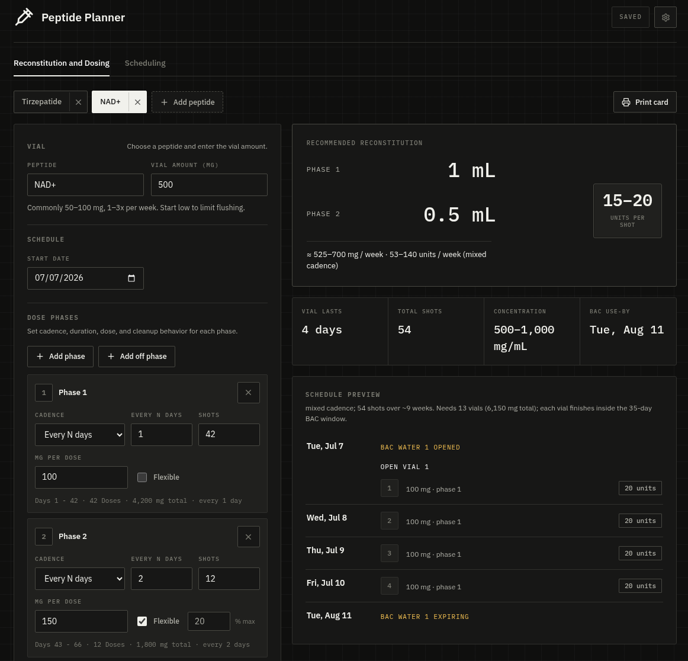
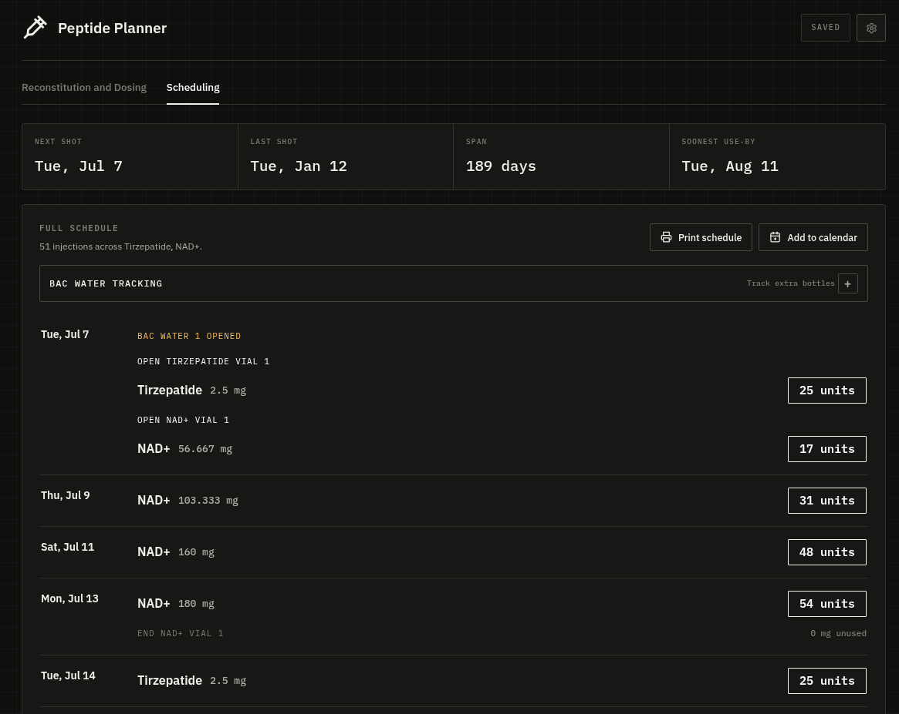

# Peptide Dose Planner





Local peptide reconstitution and scheduling planner. Choose a peptide, enter vial
amounts and dose phases, then calculate BAC water volume, syringe units, vial
duration, and a combined injection schedule.

It is a single Node process with no external dependencies (built-in HTTP + SQLite)
and a plain HTML/CSS/JS frontend, so it self-hosts cleanly on a homelab.

This is a planning utility, not medical advice. Verify dosing, concentration,
route, storage, and beyond-use dates with a qualified clinician or pharmacist.

## Run

Requires Node.js 22.5+.

```sh
npm start
```

Open `http://127.0.0.1:4173/`. Optional local overrides can go in `.env`:

```sh
HOST=127.0.0.1        # set to 0.0.0.0 to expose on your LAN
PORT=4173
PEPTIDE_PLANNER_DATA_DIR=./data
```

## Self-hosting (Docker)

The image has no build step and no dependencies to install. The SQLite database
is kept on a mounted volume so your data survives rebuilds.

```sh
docker compose up -d
```

This binds the app to `0.0.0.0:4173` inside the container and publishes it on
port `4173` of the host, storing the database in `./data` on the host. Point a
reverse proxy (Caddy, Traefik, nginx) at it if you want TLS or a hostname.

Without Compose:

```sh
docker build -t peptide-planner .
docker run -d --name peptide-planner -p 4173:4173 -v "$(pwd)/data:/data" peptide-planner
```

Back up by copying `data/peptide-planner.sqlite`, or use the in-app gear menu to
export a JSON snapshot.

## Data

The app autosaves one current planner snapshot to SQLite:

```txt
data/peptide-planner.sqlite
```

Use the gear menu to import/export JSON backups. The schedule page can export an
`.ics` calendar file, and the reconstitution page can print a vial card.

## Flexible Cleanup

When flexible dosing is enabled for a phase, vial cleanup uses a hybrid rule.
The planner first tries to spread leftover vial contents across the existing
shots from that vial, staying inside the phase's configured flex percentage. If
that would require too large an increase, it then checks whether the leftover
amount is itself a valid flexible dose for the phase. When it is, the planner
adds that amount as a cleanup shot before opening the next vial; otherwise the
amount remains marked as unused.

## Database Schema

Fresh databases use one app-owned table plus SQLite `user_version = 1`.

```sql
CREATE TABLE planner_snapshots (
  key TEXT PRIMARY KEY,
  payload_json TEXT NOT NULL,
  peptide_name TEXT,
  vial_mg REAL,
  updated_at TEXT NOT NULL DEFAULT CURRENT_TIMESTAMP,
  created_at TEXT NOT NULL DEFAULT CURRENT_TIMESTAMP
) STRICT;
```

Only the `current` key is used today. `payload_json` contains the full serialized
planner state; `peptide_name` and `vial_mg` are lightweight indexed-ready summary
fields for future list/history views. Obsolete settings tables from older local
builds are dropped on startup.

## Scripts

```sh
npm start      # run the local server
npm run check  # syntax-check server.js
```

## Structure

```txt
server.js                 Static server and SQLite persistence API
index.html / styles.css   App shell and UI styling
src/calc.js               Pure dose, water, and schedule engine
src/peptides.js           Built-in peptide reference data
src/state.js              App state, defaults, migrations
src/render.js             DOM rendering
src/main.js               Event wiring and app lifecycle
src/persistence.js        Autosave/load client
src/exporters.js          JSON and calendar exports
```
